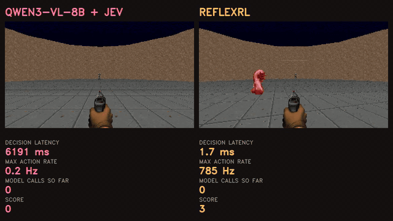
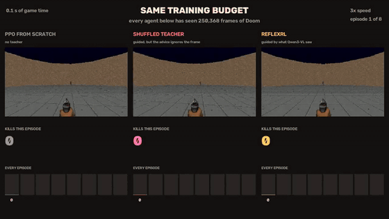
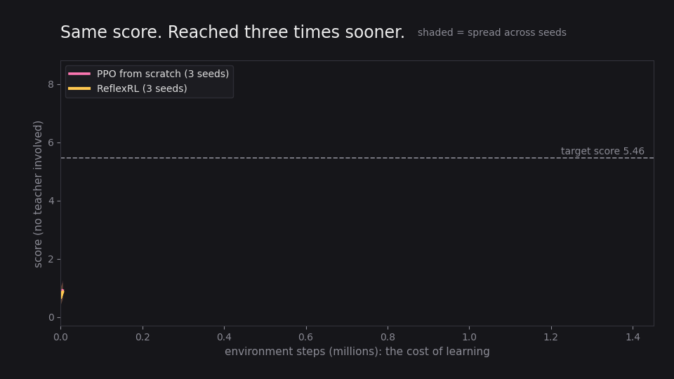
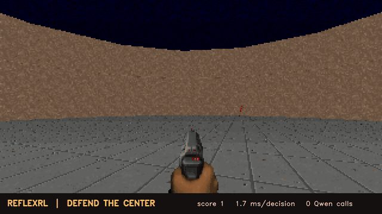

# ReflexRL

### A vision-language model knows what is in the frame. It cannot play. So move the knowledge, then delete the model.



**Left: the teacher.** 8.8B parameters, 6,191 ms per decision, frozen mid-thought while
the game runs on. It finishes on **-0.38** kills, below random.
**Right: the 751,526-parameter policy that teacher trained.** 1.7 ms per decision,
**zero model calls**, **7.25** kills. Same map, same seed, both in real time.

*Videos: [same-budget three-way comparison](results/demo/budget_comparison.mp4) (54 s)
· [45-second demo](results/demo/reflexrl_demo.mp4)
· every metric with its source file: [results/METRICS.md](results/METRICS.md)
· done / left: [STATUS.md](STATUS.md)*

---

## What is actually being claimed

That a VLM is too slow to play a shooter is not a finding. It was measured and published
independently ([Golchinfar et al., 2026](https://arxiv.org/abs/2604.07385) get a 1.3M
parameter model to beat LLMs at real-time ViZDoom). The interesting question is the one
after it: **the VLM still knows things the small network does not. Can that knowledge be
moved across, and can the move be measured?**

Yes, and the move is worth 2.95x. That it is the *knowledge* moving, rather than the
guidance machinery doing the work, is a pre-registered control rather than an assertion:
cut the link between the teacher's advice and the frame it is looking at, change nothing
else, and the 2.95x falls to **1.05x**.

| | ReflexRL | PPO from scratch | |
|---|---|---|---|
| environment steps to reach the target score | **304K** | 900K | **2.95x fewer** |
| score on 50 episodes nothing ever saw | **7.34** | 6.95 | +6% |
| spread across seeds (lower is more reliable) | **0.22** | 1.88 | **8x tighter** |
| seeds mastering a map never trained on | **3 of 3** | 0 of 3 | |

The teacher that produced this scores **4.40**. Its students finish above **7.2**, and
they stop listening to it after 6 to 10% of training. A teacher is a curriculum, not a
ceiling.

At deployment both the vision model and the decision model are **gone**. What ships is
**751,526 parameters** making **0 model calls** per action, on one CPU core.

Trained and measured entirely on **free Kaggle T4s**. Paid compute: **$0.00**.
Paid API: **~$0.05**.

---

## Four findings

### 0. The speed-up comes from what the model *saw*, not from being guided

The obvious objection to any teacher-guided result is that guidance of almost any shape
helps, and the expensive VLM is doing nothing a cheap heuristic could not. So it was
pre-registered as a control and run: an identical ReflexRL training run whose teacher
keeps the **same action vocabulary, same decision table, same adaptive handover, same
intervention correction, and the same marginal distribution over actions**, but whose
perception is drawn independently of the frame it is looking at. Right kind of advice,
wrong frame.



All three agents above have seen **exactly the same number of Doom frames**
(250,368), and play the same maps from the same seeds. The bars at the bottom are
every episode, so consistency is visible rather than asserted. Over 8 episodes:
PPO **3.0**, the decoupled control **2.1**, ReflexRL **6.1**. The left two are
usually dead inside 15 seconds.

*Full 54-second version, 8 episodes per agent:
[results/demo/budget_comparison.mp4](results/demo/budget_comparison.mp4).
Rebuild with `python scripts/make_budget_video.py`. These are sampled episodes
from one seed per arm, shown to make the gap visible; the authoritative numbers
are the 16-episode evaluation curves and the 50-episode held-out test below.*

| | steps to target | **X** | final |
|---|---|---|---|
| PPO from scratch, no teacher | 900K | 1.00x | 6.69 |
| **Teacher with the frame link cut** | 853K | **1.05x** | 6.09 |
| **The real Qwen3-VL + Jev teacher** | **304K** | **2.95x** | **7.23** |

Guidance carrying no information about the frame buys **1.05x**, which is nothing. The
whole 2.95x is attributable to what the vision model actually saw. Written down before
the run, in `experiments/configs/teacher_knowledge_ablation.json`, with the prediction
"if the VLM's knowledge is doing the work, X collapses towards 1.0".

It collapsed to 1.05. The mechanism is not the point; the knowledge is.

A detail worth keeping: the shuffled teacher consumed **1.5 to 2.9x more** teacher steps
before the handover rule let it go (269K and 169K, against 93K to 144K). The rule waits
for the student to match the teacher's measured return, and a student learning from noise
takes longer to get there. The handover rule detected a useless teacher without being told
that it was useless.

### 1. Split perception from decision, and a bad player becomes a good teacher

Asked to pick actions, Qwen3-VL scores 1.7 kills on `defend_the_center`, barely above
random (0.57), whether it has 2B or 8B parameters. Four times the parameters bought
nothing, because the bottleneck was never perception.

Ask it only **what it sees**, hand the percept to a structured decision model
(TypeSafe **Jev 1.13**), and the same 8B model becomes a teacher worth **4.40**.

| controller | kills | episodes |
|---|---|---|
| random | 0.57 | 30 |
| Qwen3-VL-2B picking actions | 1.73 | 30 |
| Qwen3-VL-8B picking actions | 1.67 | 30 |
| **Qwen3-VL-8B sees, Jev decides** | **4.40** | 30 |

### 2. *What* you distil beats *how well* you distil it

This is the result worth arguing about, because it contradicts the natural design.

Two students. Same small CNN, same 3,662 teacher-labelled frames, same teacher. Both
reproduce the teacher on held-out labels about equally well. The only difference is what
the label *is*:

| student | copies the teacher's... | agreement with teacher | kills |
|---|---|---|---|
| action-cloned | chosen **action** | 0.655 | 0.88 |
| **perception-distilled** (Jev still decides) | **percept** | 0.629 (lower) | **2.53** |

The student with *worse* fidelity scores **2.9x higher**. Copying behaviour faithfully
copies the teacher's mistakes and discards the structure that made it good. Copying what
it *saw*, and rebuilding the decision on top, keeps the useful part.

The percept is recovered by least squares: the teacher's action distribution is
π_T = q · J for a known decision table J, so q is inverted back out of it.

### 3. You can tell in advance whether a VLM can teach a task

The same four-way question, scored against ground truth, predicts everything downstream:

| setting | question | accuracy | majority baseline |
|---|---|---|---|
| Doom `defend_the_center` | which way is the monster | **0.733** | 0.313 |
| Doom `health_gathering` | is a medkit visible, and where | 0.740 | 0.640 |
| **Valorant, real gameplay frames** | which way is the nearest player | **0.747** | 0.493 |
| Valorant, real gameplay frames | which of them is an *enemy* | 0.307 | 0.620 |

**The model is good at *where*, and bad at *whether* and *which kind*.** That one
sentence predicted, in advance, which scenarios would work. `defend_the_center` works
because a monster is nearly always on screen, so only direction matters.
`health_gathering` does not, because 96 of 150 frames contain no medkit and the model
cannot report absence.

A 20-minute probe tells you whether a VLM can teach a task before you spend a GPU-day
finding out. That generalises past Doom: the localisation result holds on real Valorant
footage, the friend/foe judgement does not, since it needs team colours nobody supplied.

---

## The system

```text
                    TRAINING                                    DEPLOYMENT

   frame ──► Qwen3-VL-8B ──► "monster on the left"
                                    │                            frame
                                    ▼                              │
                              Jev 1.13  ──► TURN_LEFT_FIRE 0.92     ▼
                                    │                        reflex policy
                                    ▼                         (0.75M params)
                            teacher π_T(a|o)                       │
                                    │                              ▼
                   guides exploration, then steps aside          action
                                    │
                                    ▼
                            PPO ──► reflex policy            0 model calls
```

The policy sees **pixels only**: 4 stacked RGB frames at 64x112. No depth buffer, no
object labels, no game variables (`tests/test_core.py` enforces this).

Teacher influence is handed over as the student catches up: 100%, 50%, 25%, 10%, 0. Each
step is taken only when the student's own score reaches the teacher's. That adaptivity is
load-bearing. On the held-out map, a *fixed* schedule let a 4.40 teacher override an
18-scoring student and made transfer **0.86x**, worse than no teacher at all.

## Results

Full tables, per-seed data, learning curves, confusion matrices and the source file for
every number: **[results/METRICS.md](results/METRICS.md)**. Rebuild with
`python scripts/metrics_report.py`; nothing is typed by hand.

### Sample efficiency (3 seeds x 1.5M steps, target R\* = 5.46, pre-registered)



| method | steps to R\*, per seed | X | final, 50 unseen episodes |
|---|---|---|---|
| PPO from scratch | 900K, 1400K, 600K | 1.00x | 6.95 |
| BC then PPO (same teacher, same labels) | 604K, 704K, **never** | | 6.80 |
| *Teacher with the frame link cut* (control) | 803K, 903K | *1.05x* | not in the final-eval set |
| **ReflexRL (guided, adaptive handover)** | **304K, 304K, 304K** | **2.95x** | **7.34** |
| ReflexRL (live Qwen+Jev DAgger rounds) | 353K, 353K | 2.54x | 7.24 |
| ReflexRL (fixed anneal, 1 seed) | 453K | 1.98x | not in the final-eval set |

The 3,662 environment steps spent collecting teacher labels are charged to every
teacher-using method before the comparison.

**BC then PPO is the control that matters.** Identical teacher, identical labels,
identical budget: imitate first, then run the same PPO. It produces no reliable speed-up
and one seed never reaches the target. What produces X is *guiding exploration and handing
control back*, not having the teacher's answers baked into the weights.

### Reliability, on episodes nothing ever saw

| method | mean | worst seed | best seed | spread |
|---|---|---|---|---|
| PPO from scratch | 6.95 | 5.96 | 7.84 | 1.88 |
| BC then PPO | 6.80 | 4.56 | 8.14 | 3.58 |
| **ReflexRL** | **7.34** | **7.20** | 7.42 | **0.22** |

50 episodes from seeds 7,000,000+, disjoint from training (0 to 2011), in-training
evaluation (900,000+) and teacher labelling (50,000+). On a 3-seed budget the 8x tighter
spread is a stronger claim than the mean, and it is the one this project leans on.

### Held-out map (`defend_the_line`: new layout, same controls)

| | reaches 19.9 kills | reaches 21.5 | final |
|---|---|---|---|
| PPO from scratch | 350K steps | **0 of 3 seeds** | 21.54 |
| PPO policy fine-tuned | 350K | 1 of 3 | 21.17 |
| **ReflexRL policy fine-tuned** | **250K** | **3 of 3** | **23.14** |
| ReflexRL fine-tuned *with* the teacher | 201K | 3 of 3 | 23.32 |

Zero-shot transfer is near random for every policy. What transfers is how fast the new map
is re-learned.

### Deployment, the consequence rather than the claim

Latency and cost are benchmarked against Qwen3-VL-**2B**, the cheapest thing that could
plausibly be deployed. The real-time score is measured against the actual teacher,
Qwen3-VL-**8B** + Jev, because that is what taught the policy.

| | reflex policy | Qwen3-VL-2B | ratio |
|---|---|---|---|
| parameters | 751,526 | 2.1B | 2,831x |
| FLOPs per action | 28.9M | 1.29T | 44,613x |
| latency, same T4 | 2.57 ms | 445 ms | **173x** |
| USD per 10K decisions | $0.0004 (one CPU core) | $0.73 | **173x** |
| model calls per action | **0** | 1 | |

| | reflex policy | Qwen3-VL-8B + Jev (its teacher) |
|---|---|---|
| latency per decision | 1.7 ms | 6,191 ms |
| kills when the game does **not** wait | **7.25** | **-0.38** |



*The shipped artefact: 751,526 parameters, 1.7 ms per decision, no vision model and no
decision model anywhere in the loop.*

## What failed, and why it is in the repo

1. **fp16 silently corrupts Qwen3-VL on pre-Ampere GPUs.** For a day the teacher looked
   like it had multiple-choice position bias, always answering A. It was emitting garbage:
   **0.03%** of its probability landed on *any* answer letter, and renormalising over
   letters hid that. A synthetic control (a red circle, left/centre/right) exposed it:
   **25% correct in fp16, 100% in fp32**. Every teacher number measured before the fix was
   discarded. The code now runs fp32 (4-bit weights with fp32 compute for 8B) and refuses
   to emit a label when letter mass drops below 0.5.
2. **Bigger did not help.** 2B: 1.73. 4B: failed the probe. 8B: 1.67. The ceiling was the
   *decision*, not the perception, which is what motivated finding 1.
3. **Three of four scenarios failed the pre-registered teacher gate** and were not used.
   All three require reporting *absence*, which the perception probes show the model
   cannot do. The gate caught it before any GPU-hours were spent.
4. **Contextual calibration helps the action teacher and destroys the perception probes**
   (0.740 to 0.253). It removes answer bias, but it also erases genuinely skewed class
   priors. Both numbers are reported rather than whichever flatters.

Pre-registrations for every gate and metric are in `experiments/configs/*.json`, written
before the corresponding run.

## No train/test leakage

Training, in-training evaluation, teacher labelling and final reporting use disjoint
environment-seed streams (0 to 2011 / 900,000+ / 50,000+ / 7,000,000+).
`tests/test_seed_hygiene.py` fails the build if any two overlap.
`tests/test_probe_alignment.py` asserts probe frames and their oracle labels come from the
same rollout. It exists because they once did not, and the bug made the teacher look worse
than it is.

## Reproduce

```bash
pip install -e .[dev]
pytest tests                                   # 28 tests: pixels-only, IS correction, resume, seeds
python scripts/teacher_gate.py --policy random --scenarios dtc --episodes 30
python scripts/jev_table.py                    # 4 Jev calls (~$0.0001), cached
python scripts/teacher_gate.py --policy qwen --model Qwen/Qwen3-VL-8B-Instruct --nf4 \
       --variant perception_jev --scenarios dtc --episodes 30
python scripts/build_perception_teacher.py --scenario dtc --labels runs/phase0/*/labels
python scripts/train.py --method reflexrl --scenario dtc --steps 1500000 --seed 0
python scripts/final_eval.py                   # fresh unseen episodes
python scripts/metrics_report.py               # rebuild results/METRICS.md
python scripts/make_budget_video.py            # the same-budget three-way comparison
python scripts/make_gifs.py                    # rebuild every animation above
```

Kaggle job definitions, one per experiment, all on free T4s, are in `kaggle/`.
`scripts/sync_kaggle.py` mirrors their outputs back into `archive/kaggle/`, which is
where every number in `results/METRICS.md` is read from.

### Where things are

| path | what it holds |
|---|---|
| `results/METRICS.md` | every measurement, with per-seed data and the file it came from |
| `results/SCOREBOARD.md` | the same headline numbers, rebuilt by `scripts/scoreboard.py` |
| `archive/kaggle/` | the raw output of all 24 Kaggle jobs; nothing is hand-edited |
| `experiments/configs/*.json` | pre-registrations, each written before its run |
| `reflexrl/teacher/` | Qwen wrapper, calibration, Jev client, perception teacher |
| `reflexrl/rl/` | PPO with guidance, the handover schedules, DAgger |
| `tests/` | 28 tests, including the pixels-only and seed-hygiene guards |

## Limitations

- One scenario carries the main result, and the held-out map shares its controls. The gate
  in [METRICS.md §8](results/METRICS.md) is the honest statement of where this teacher
  works.
- 3 seeds per method. Enough to show a spread, not enough for tight confidence intervals.
  This is the weakest part of the evidence.
- The percept vocabulary (monster left/centre/right/none) and Jev's option list were
  written by hand. The models decide; the abstraction is human-chosen.
- The online teacher during RL is a *distilled copy* of the Qwen+Jev teacher, scoring 2.53
  against the original's 4.40. Everything downstream is taught by a degraded copy and the
  students still finish above 7.2. Live rounds, with Qwen queried on the student's own
  states, are the `--dagger` path, at 2.54x.

## Where this sits

The closest work is **LVLM2P** ([Lee et al., 2025](https://arxiv.org/abs/2505.11221)),
which also distils a large vision-language model into an RL agent to cut sample
complexity, and also has the VLM act as a teacher during training rather than at
deployment. It has the VLM supply **instructional actions**. This project's finding 2 is
that on `defend_the_center` that is the part which fails: action-cloning the same teacher
scores 0.88, while distilling its *percept* and keeping a typed decision layer scores 2.53
from the same labels. The disagreement is concrete and testable, not a difference in
framing.

**GameSense** ([Lu et al., 2025](https://arxiv.org/abs/2503.21263)) reaches a similar
conclusion from the other direction: stop having the VLM control the game and have it
build specialised execution modules instead. There the VLM writes the module; here RL
trains it, and the teacher is switched off by a rule rather than by hand.

**Playing DOOM with 1.3M Parameters**
([Golchinfar et al., 2026](https://arxiv.org/abs/2604.07385)) establishes the premise this
project starts from, that a small specialised model beats an LLM at real-time ViZDoom,
which is why latency is treated here as a consequence and not as a result.

The older lineage is teacher-guided RL with an annealed teacher: Kickstarting
([Schmitt et al., 2018](https://arxiv.org/abs/1803.03835)) and Jump-Start RL
([Uchendu et al., 2022](https://arxiv.org/abs/2204.02372)). What is added here: the
teacher is a vision-language model **restricted to perception** and paired with a
structured decision model; the handover is **adaptive**, triggered by the student matching
the teacher rather than by a schedule; and every cost, including the environment steps
spent collecting teacher labels, is charged to the method.
