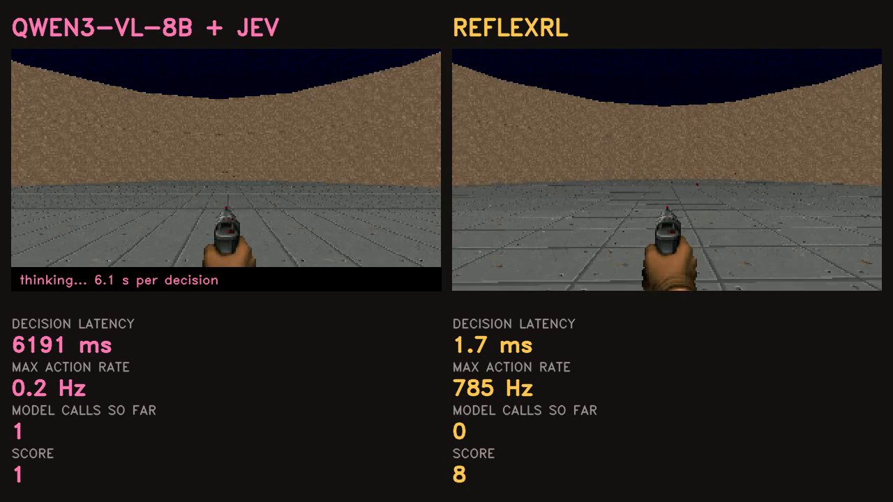

# ReflexRL

### Foundation models can't play. They can teach — if you only ask them what they see.



*45-second demo video: [results/demo/reflexrl_demo.mp4](results/demo/reflexrl_demo.mp4)*

A vision-language model is a **bad** Doom player. Asked to pick actions, Qwen3-VL scores
1.7 kills on `defend_the_center`, barely above random (0.6), whether it has 2B or 8B
parameters. Split the job — let the VLM say **what it sees**, let a structured decision
model (TypeSafe **Jev 1.13**) decide **what to do** — and the same model becomes a
teacher worth 4.4 kills.

Use that teacher to guide reinforcement learning, hand control back to the student as it
improves, and the resulting **0.75M-parameter CNN**:

| | measured |
|---|---|
| reaches the target score with | **2.95× fewer environment steps** than PPO from scratch |
| final score | **7.23** vs PPO's 6.69 (**108%**) |
| decision latency | **2.57 ms** vs 445 ms for the VLM (**173× faster**) |
| cost per 10K decisions | **$0.0004** on one CPU core vs $0.77 (**173× cheaper** on the same GPU) |
| real time, when the game does not wait | **7.25 kills** vs **−0.38** for its own teacher |
| model calls at deployment | **0** |

Everything was trained and measured on **free Kaggle T4s**. Total paid spend: **$0.05** of
Jev API calls.

---

## The system

```text
                    TRAINING                                    DEPLOYMENT

   frame ──► Qwen3-VL-8B ──► "monster on the left"
                                    │                            frame
                                    ▼                              │
                              Jev 1.13  ──► TURN_LEFT_FIRE 0.92     ▼
                                    │                        reflex policy
                                    ▼                         (0.75M params)
                            teacher π_T(a|o)                       │
                                    │                              ▼
                   guides exploration, then steps aside          action
                                    │
                                    ▼
                            PPO ──► reflex policy            0 model calls
```

The policy sees **pixels only**: 4 stacked RGB frames at 64×112. No depth buffer, no
object labels, no game variables (`tests/test_core.py` enforces this).

Teacher influence is handed over as the student catches up: 100% → 50% → 25% → 10% → 0,
each step taken only when the student's own score reaches the teacher's. In practice the
teacher is gone by ~200K of 1.5M steps, and the student ends up **better than every
teacher in the chain**.

## Results

`results/SCOREBOARD.md` is regenerated from the result files by
`python scripts/scoreboard.py`. Highlights:

### Controllers (game paused, so slow models aren't penalised)

| controller | kills on `defend_the_center` |
|---|---|
| random | 0.57 |
| Qwen3-VL-2B alone | 1.73 |
| Qwen3-VL-8B alone | 1.67 |
| **Qwen3-VL-8B sees + Jev decides** | **4.40** |

Four times the parameters bought nothing. The decision layer quadrupled the score.

### Learned policies (1.5M steps, 3 seeds, target = 80% of the way from random to PPO's final)

| method | final (per seed) | steps to target | X |
|---|---|---|---|
| PPO from scratch | 6.95 (7.8, 7.1, 6.0) | 900K, 1400K, 600K | 1.00× |
| BC → PPO (same teacher, imitate then RL) | 6.80 (8.1, 7.7, 4.6) | 604K, 704K, **never** | — |
| **ReflexRL (guided, adaptive handover)** | **7.34 (7.4, 7.4, 7.2)** | **304K ×3** | **2.95×** |
| ReflexRL (live Qwen+Jev rounds) | 7.24 (7.3, 7.2) | 353K ×2 | 2.54× |
| ReflexRL (fixed schedule, 1 seed) | 7.38 | 453K | 1.98× |
| the distilled teacher that guided it | 3.10 | — | — |

Final scores come from **50 episodes on seeds 7,000,000+**, which no training run and no
handover decision ever saw. ReflexRL is the only method without a bad seed (spread 0.22 vs
1.88 for PPO and 3.58 for BC→PPO), and it more than doubles the score of the teacher that
guided it.

BC→PPO is the sharp control: the same teacher and the same labels, but imitating first and
then doing RL gives no reliable gain. The gain comes from *guiding exploration and handing
back control*.

### Held-out map (`defend_the_line`: different layout, same controls, 3 seeds)

| | reaches 19.9 kills | reaches 21.5 kills |
|---|---|---|
| PPO from scratch | 301K steps | **never** (0/3 seeds) |
| PPO policy fine-tuned | 301K | 1/3 seeds |
| **ReflexRL policy fine-tuned** | **250K** | **3/3 seeds** |
| ReflexRL fine-tuned *with* the teacher | 250K | 3/3 seeds |

The last row is where the adaptive handover earns its place: arriving with a policy that
already outscores the teacher, the rule drops teacher influence to zero at the first
evaluation, so guidance costs nothing (final 23.32 vs 23.14 unguided). An earlier version
that stepped down too slowly let a 2.53-scoring teacher override an 18-scoring student and
made transfer **0.86×** — a fixed schedule cannot avoid that.

Zero-shot transfer is near random for every policy; what transfers is how fast the map is
re-learned.

### Deployment

| | reflex policy | Qwen3-VL-2B |
|---|---|---|
| parameters | 751,526 | 2.1B |
| FLOPs per action | 28.9M | 1.29T |
| latency (same T4) | 2.85 ms | 468 ms |
| real-time score (the game does not wait) | **7.25** | **−0.38** (Qwen-8B + Jev, 6.2 s/decision) |

### Where the teacher works, and where it does not

The same perception question, asked of Qwen3-VL-8B in three settings and scored against
ground truth (ViZDoom's object labels; the Valorant dataset's bounding boxes):

| setting | question | accuracy | guessing the most common answer |
|---|---|---|---|
| Doom, `defend_the_center` | which way is the monster | **0.73** | 0.31 |
| Doom, `health_gathering` | is a medkit visible, and where | 0.74 | 0.64 |
| **Valorant, real frames** | which way is the nearest player | **0.75** | 0.49 |
| Valorant, real frames | which of them is an *enemy* | 0.35 | 0.62 |

The model is good at *where*, and bad at *whether* and *which kind*. That is why
`defend_the_center` works (monsters are nearly always on screen, so only direction
matters) and `health_gathering` does not (96 of 150 frames contain no visible medkit, and
the model cannot report absence). On real Valorant frames it localises characters well
(75% against a 49% baseline, 150 frames), but it cannot tell
enemies from teammates, which needs team colours nobody told it about.

Two measurement errors were found and fixed while producing this table, both of which had
made the model look worse than it is: Health-Gathering distance labels were generated from
a *different* rollout than the frames the model saw, and 90 of the 93 Valorant frames
labelled "no enemy" actually contained a teammate, so the model was penalised for
correctly seeing a person. `tests/test_probe_alignment.py` now guards the first.

Contextual calibration — dividing out the answer prior measured on a blank frame, which is
what rescued the *action* teacher on `defend_the_center` — makes the perception numbers
**worse** (0.74 to 0.25 on Health Gathering). It removes answer bias, but it also
erases genuinely skewed class priors, and here the skew is in the world rather than the
model.

## What failed, and why that matters

1. **fp16 silently corrupts Qwen3-VL on pre-Ampere GPUs.** For a day the teacher looked
   like it had multiple-choice "position bias" — always answering A. It was actually
   emitting garbage: only 0.03% of its probability landed on *any* answer letter, and
   renormalising over letters hid that. A synthetic control (a red circle on the left,
   centre or right) exposed it: **25% correct in fp16, 100% in fp32**. Every teacher
   result before the fix was discarded. The code now runs fp32 (or 4-bit weights with
   fp32 compute for 8B) and refuses to emit labels when the answer-letter mass drops
   below 0.5.
2. **Bigger VLMs did not help.** 2B: 1.73. 4B: failed the probe. 8B: 1.67. The ceiling
   was the *decision*, not the perception.
3. **Action cloning the teacher fails.** A network imitating the teacher's actions scores
   0.88. Distilling its *perception* and keeping Jev as the decision maker scores 2.53 and
   is what guided RL actually uses.
4. **Health Gathering and Deadly Corridor were dropped.** The VLM cannot report *absence*:
   in 96 of 150 Health-Gathering frames no medkit is visible, and its accuracy (0.74)
   barely clears the 0.64 you get by always answering "none". A teacher that plays at
   random level is useless, so those scenarios are reported as negatives rather than
   carried.

Pre-registrations for every gate and metric are in `experiments/configs/*.json`, written
before the corresponding runs.

## No train/test leakage

Training, in-training evaluation, and the final reported numbers come from disjoint
environment-seed streams (training 0–2011, validation 900,000+, final test 7,000,000+,
teacher labels 50,000+). `tests/test_seed_hygiene.py` fails if they ever overlap.

## Reproduce

```bash
pip install -e .[dev]
pytest tests                                   # 19 tests: pixels-only, IS correction, resume, seeds
python scripts/teacher_gate.py --policy random --scenarios dtc --episodes 30
python scripts/jev_table.py                    # 4 Jev calls (~$0.0001), cached to experiments/configs/
python scripts/teacher_gate.py --policy qwen --model Qwen/Qwen3-VL-8B-Instruct --nf4 \
       --variant perception_jev --scenarios dtc --episodes 30
python scripts/build_perception_teacher.py --scenario dtc --labels runs/phase0/*/labels
python scripts/train.py --method reflexrl --scenario dtc --steps 1500000 --seed 0
python scripts/final_eval.py                   # fresh unseen episodes
python scripts/make_demo.py                    # benchmark + real-time + video
```

Kaggle job definitions (one per experiment, free T4s) are in `kaggle/`.

## Limitations

- One scenario carries the main result; the held-out map shares its controls.
- The perception vocabulary (monster left/centre/right/none) and Jev's option list were
  written by hand. The models decide; the abstraction is human-chosen.
- The online teacher during RL is a distilled copy of the Qwen+Jev teacher; live rounds
  (Qwen queried on the student's own states, Jev deciding per state) are the
  `--dagger` path.
- 3 seeds per method. Enough to show the spread, not enough for tight confidence
  intervals.

## Related work

Kickstarting ([Schmitt et al., 2018](https://arxiv.org/abs/1803.03835)), Jump-Start RL
([Uchendu et al., 2022](https://arxiv.org/abs/2204.02372)) and LLM policy teachers
([Zheng et al., 2023](https://arxiv.org/abs/2311.13373)) all guide RL with a teacher and
anneal its influence. What is different here: the teacher is a **vision-language model
restricted to perception**, paired with a **structured decision model**, and every cost —
including the environment steps spent collecting teacher labels — is charged to the
method.
